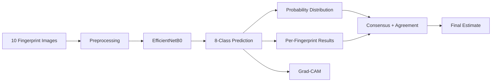

# Fingerprint Blood Group Prediction

<p align="center">
  
</p>

<p align="center">
  <strong>Experimental deep learning • multi-fingerprint consensus • explainable AI</strong>
</p>

<p align="center">
  <a href="#-verified-results">97.47% Accuracy</a> •
  <a href="#-grad-cam-explainability">Grad-CAM</a> •
  <a href="#-quick-start">Quick Start</a> •
  <a href="#-limitations">Limitations</a>
</p>

---

## What makes this project different?

Most image-classification demos stop at:

> **Image → Label**

This project is designed as a complete inference pipeline:

> **10 fingerprints → 8-class prediction → probabilities → consensus → explanation**

The interface exposes both the **decision** and the **evidence the model provides for that decision**, while keeping the system clearly labelled as an academic research prototype.

---

## ✦ At a glance

| | |
|:--|:--|
| **Model** | EfficientNetB0 |
| **Input** | 96 × 103 × 3 |
| **Classes** | A+, A-, AB+, AB-, B+, B-, O+, O- |
| **Evaluation set** | 6,000 labelled fingerprint images |
| **Accuracy** | **97.47%** |
| **Macro F1** | **97.54%** |
| **Weighted F1** | **97.47%** |
| **Explainability** | Grad-CAM |
| **Web stack** | Flask + HTML/CSS/JavaScript |

---

## ◇ End-to-end pipeline



---

## 🧠 Model architecture

```text
Input: 96 × 103 × 3
        │
        ▼
┌───────────────────────┐
│      EfficientNetB0   │
│  Transfer-learned CNN │
└──────────┬────────────┘
           │
           ▼
┌───────────────────────┐
│ Global Average Pooling│
└──────────┬────────────┘
           │
           ▼
┌───────────────────────┐
│ Batch Normalization   │
└──────────┬────────────┘
           │
           ▼
┌───────────────────────┐
│ Dropout               │
└──────────┬────────────┘
           │
           ▼
┌───────────────────────┐
│ Dense(8)              │
└──────────┬────────────┘
           │
           ▼
      8 Blood Groups
```

### Supported classes

`A+` · `A-` · `AB+` · `AB-` · `B+` · `B-` · `O+` · `O-`

---

## 📈 Verified results

The existing trained model was evaluated on **6,000 labelled fingerprint images**.

### Headline metrics

| Metric | Result |
|:--|--:|
| **Accuracy** | **97.47%** |
| **Macro F1** | **97.54%** |
| **Weighted F1** | **97.47%** |
| Images evaluated | 6,000 |
| Classes | 8 |

### Class-wise performance

| Class | Precision | Recall | F1 |
|:--:|--:|--:|--:|
| A+ | 98.76% | 98.58% | 98.67% |
| A- | 95.93% | 98.02% | 96.96% |
| AB+ | 98.99% | 96.75% | 97.86% |
| AB- | 99.31% | 94.22% | 96.70% |
| B+ | 98.46% | 97.85% | 98.15% |
| B- | 96.85% | 99.73% | 98.27% |
| O+ | 98.21% | 96.71% | 97.46% |
| O- | 94.33% | 98.17% | 96.21% |

> **Interpretation:** these are dataset-level experimental results. They should not be presented as clinical accuracy.

---

## 🔬 Grad-CAM explainability

A prediction screen should not be a black box.

For an individual fingerprint, the application can produce:

```text
Original Fingerprint
        │
        ▼
EfficientNetB0
        │
        ▼
Predicted Class
        │
        ▼
Grad-CAM
        │
        ▼
Attention / activation heatmap
```

The heatmap helps visualize the image regions that contributed most to the model's prediction.

**Important:** Grad-CAM is an interpretability tool. It is not evidence of biological causation.

---

## 🎯 Multi-fingerprint consensus

Rather than relying on a single fingerprint:

```text
Fingerprint 01 → A+
Fingerprint 02 → A+
Fingerprint 03 → A-
Fingerprint 04 → A+
...
Fingerprint 10 → A+

             ↓

      Vote distribution
             +
      Mean probabilities
             +
      Agreement score
             ↓

       Final estimate
```

The UI exposes:

- fingerprint agreement
- winning votes
- vote margin
- 8-class probability distribution
- per-fingerprint confidence

This makes the final output easier to inspect and defend during a project demonstration.

---

## 🖥️ Application experience

The application contains four major views:

**1. Analysis launcher**  
Select exactly 10 BMP fingerprint samples.

**2. Model performance**  
See the verified evaluation metrics and architecture.

**3. Consensus result**  
Review the final estimate, agreement, voting and probability distribution.

**4. Explainable AI**  
Open Grad-CAM for an individual fingerprint.

---

## 🧰 Tech stack

| Layer | Technology |
|:--|:--|
| Language | Python |
| Deep learning | TensorFlow / Keras |
| CNN backbone | EfficientNetB0 |
| Web framework | Flask |
| Image processing | Pillow + NumPy |
| Explainability | Grad-CAM |
| Evaluation | Scikit-learn |
| Frontend | HTML + CSS + JavaScript |

---

## 📁 Repository structure

```text
Fingerprint-blood-group-prediction/
│
├── app.py
├── gradcam.py
├── requirements.txt
├── README.md
├── LICENSE
├── .gitignore
│
├── assets/
│   └── banner.svg
│
├── model/
│   ├── final_best_efficientnetb0_model_final.keras
│   └── Model Training and Testing Code.ipynb
│
├── utils/
│   └── predict.py
│
├── templates/
│   └── index.html
│
└── static/
    ├── input_images/
    └── gradcam/
```

Training datasets and the local virtual environment are intentionally excluded from version control.

---

## ⚡ Quick Start

### 1. Clone

```bash
git clone https://github.com/monugupta7033/Fingerprint-blood-group-prediction.git
cd Fingerprint-blood-group-prediction
```

### 2. Create environment

```bash
python -m venv venv
```

### 3. Activate on Windows

```powershell
venv\Scripts\Activate.ps1
```

### 4. Install dependencies

```bash
pip install -r requirements.txt
```

### 5. Run the application

```bash
python app.py
```

Open:

```text
http://127.0.0.1:5000
```

---

## 🧪 Demo flow

1. Launch the Flask application.
2. Select **10 BMP fingerprint images**.
3. Run the analysis.
4. Inspect per-fingerprint predictions.
5. Compare the 8-class probability distribution.
6. Review consensus and agreement.
7. Open **Explain Prediction** for Grad-CAM.

---

## 📌 Project limitations

- This is an **academic research prototype**.
- The reported metrics are based on the labelled dataset used for evaluation.
- Dataset-level performance does not establish medical or clinical validity.
- Fingerprint-to-blood-group relationships require independent scientific validation.
- The system should not be used for transfusion, diagnosis, treatment, emergency decisions, or healthcare decisions.
- Grad-CAM shows model attention, not biological causation.

---

## 🚀 Future scope

- Browser-native image uploads for cloud deployment
- Subject-independent train / validation / test splits
- Larger independently collected datasets
- Cross-dataset validation
- Confidence calibration and uncertainty estimation
- Ensemble models
- Additional explainability methods
- Mobile inference
- Formal clinical validation under appropriate research protocols

---

## 🎓 Academic workflow

```text
Dataset
   ↓
Preprocessing
   ↓
Transfer Learning
   ↓
Model Evaluation
   ↓
Inference
   ↓
10-Sample Aggregation
   ↓
Explainable AI
   ↓
Interactive Web Application
```

This makes the project an end-to-end applied machine-learning prototype combining **computer vision, deep learning, evaluation, decision aggregation, explainability, and web development**.

---

## ⚠️ Disclaimer

> **This software is for academic and research purposes only.**
>
> The application produces an experimental prediction from fingerprint images and is **not a medically validated blood-group test**. Do not use its output for transfusion, diagnosis, treatment, emergency decisions, or other healthcare purposes.

---

## Repository

**GitHub:**  
https://github.com/monugupta7033/Fingerprint-blood-group-prediction

---

<p align="center">
  <sub>Built as an academic deep-learning & computer-vision research project.</sub>
</p>
